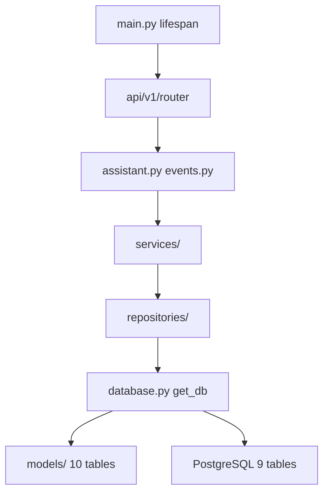

# Структура backend-сервиса diaai

Сводка и design review структуры FastAPI backend. Опирается на [ADR-002](../adr/adr-002-backend-stack.md) · [ADR-003](../adr/adr-003-data-access-layer.md) · skill [fastapi-templates](../../.agents/skills/fastapi-templates/SKILL.md).

## Статус реализации

Каталог `backend/` **реализован** (backend task-03–08 ✅). Слой данных — **database iter 5** ✅: миграции `001` + `002`, 9 таблиц, 10 ORM-моделей, 10 repositories, 5 services.

**Тесты:** `make test` — **51** (36 backend + 15 bot).

## Фактическое дерево

```
backend/
├── __init__.py
├── main.py                 # create_app(), lifespan, middleware, exception handlers
├── config.py               # pydantic-settings
├── database.py             # engine, AsyncSessionLocal, get_db
├── exceptions.py           # AppError → ErrorBody
├── api/
│   ├── deps.py             # verify_service_token
│   └── v1/
│       ├── router.py       # assistant + events
│       ├── assistant.py
│       └── events.py
├── schemas/
│   ├── assistant.py
│   ├── events.py
│   └── errors.py
├── models/                 # один файл — одна таблица
│   ├── user.py
│   ├── dialog.py
│   ├── request.py          # dialog_requests
│   ├── food_event.py
│   ├── insulin_event.py
│   ├── photo_analysis.py
│   ├── progress_snapshot.py
│   ├── recommendation.py
│   └── consultation.py
├── repositories/
│   ├── user.py
│   ├── dialog.py
│   ├── request.py
│   ├── food_event.py
│   ├── insulin_event.py
│   ├── photo_analysis.py
│   ├── progress_snapshot.py
│   ├── recommendation.py
│   └── consultation.py
├── services/
│   ├── assistant_service.py    # LLM + photo_analyses persist
│   ├── events_service.py
│   ├── llm_service.py
│   ├── progress_service.py     # stub для backend 09–12
│   └── consultation_service.py   # stub для backend 09–12
└── tests/
    ├── conftest.py
    ├── test_health.py
    ├── test_auth.py
    ├── test_validation.py
    ├── test_assistant.py       # incl. photo → photo_analyses
    ├── test_events.py
    ├── test_events_domain.py
    ├── test_backend_settings.py
    ├── test_migrations.py
    └── test_repositories_extended.py

alembic/                      # корень репо
├── env.py                    # metadata → backend.models (10 моделей)
└── versions/
    ├── 001_initial_schema.py
    └── 002_full_data_layer.py
```

## Маппинг fastapi-templates → diaai

| fastapi-templates | diaai (ADR-002, KISS) |
|-------------------|------------------------|
| `app/main.py` | `backend/main.py` |
| `app/core/config.py` | `backend/config.py` (без `core/`) |
| `app/core/database.py` | `backend/database.py` |
| `app/api/dependencies.py` | `backend/api/deps.py` |
| `app/api/v1/endpoints/*.py` | `backend/api/v1/{assistant,events}.py` |
| `app/api/v1/router.py` | `backend/api/v1/router.py` |
| `app/schemas/` | `backend/schemas/` |
| `app/services/` | `backend/services/` |
| `app/repositories/` | `backend/repositories/` |
| `app/models/` | `backend/models/` |
| `tests/conftest.py` + `dependency_overrides` | `backend/tests/conftest.py` |

**Обоснование отличий:** один пакет `backend/` в корне репо (не `src/`), без лишнего `core/` — [conventions.mdc](../../.cursor/rules/conventions.mdc), KISS.

## Design review (fastapi-templates)

Проверка по [SKILL.md](../../.agents/skills/fastapi-templates/SKILL.md) и [details.md](../../.agents/skills/fastapi-templates/references/details.md). Последняя сверка — database iter 5 (2026-06-07).

### Pass

| Критерий | diaai |
|----------|-------|
| Async route handlers | `async def` в v1 routers |
| Dependency injection | `api/deps.py`: Bearer, settings; `get_db`, `get_llm_service` |
| Lifespan | `@asynccontextmanager` в `main.py`; init/dispose DB |
| Router aggregation | `api/v1/router.py` → `include_router(..., prefix="/api/v1")` |
| Pydantic schemas отдельно от routes | `backend/schemas/` |
| Service / repository слои | thin repos без BaseRepository (ADR-003) |
| Session-scoped repos | `Repository(session)` — корректнее async, чем singleton из шаблона |
| Testing | httpx `AsyncClient`, `ASGITransport`, `dependency_overrides`; **51** test |
| App factory | `create_app()` для tests |
| Photo persist через service | `assistant_service` → `PhotoAnalysisRepository` на `photo`/`mixed` |

### Warn (зафиксировано, не блокирует)

| Критерий | Наблюдение | Решение |
|----------|------------|---------|
| CORS middleware | в шаблоне есть | defer до web-клиента |
| `core/` subpackage | шаблон использует | плоский `config.py`, `database.py` — ADR-002 |
| BaseRepository generic | шаблон | не вводить на MVP — ADR-003 |
| `endpoints/` subfolder | шаблон | два домена — файлы в `v1/` достаточно |
| Analytics services без routers | `progress_service`, `consultation_service` | endpoints — backend iter 4 (09–12) |
| `RecommendationRepository` | repo есть, service нет | backend task 11 |
| Migration tests | metadata smoke на sqlite | PG smoke — `make db-reset` |

### Fix (внесено)

| Проблема | Действие | Статус |
|----------|----------|--------|
| `pyproject.toml` без backend | `[tool.setuptools.packages.find] where = ["src", "."]` | ✅ |
| Alembic metadata | импорт всех моделей в `alembic/env.py` | ✅ |
| Health вне v1 | `GET /health` на app root | ✅ |
| 5 таблиц → 9 | миграция `002_*`, models/repos/services | ✅ database iter 5 |

## Слой данных

Практика доступа к PostgreSQL — [database-access.md](database-access.md) · [schema-er.md](../spec/schema-er.md).

| Слой | Каталог | Ответственность |
|------|---------|-----------------|
| Session / DI | `database.py` | engine, `get_db`, commit/rollback |
| ORM | `models/` | одна модель = один файл = одна таблица |
| Queries | `repositories/` | SQLAlchemy select/add/flush; без HTTP |
| Domain | `services/` | бизнес-правила, orchestration |
| HTTP | `api/v1/` | routers; `Depends(get_db)`; без SQL |
| Migrations | `alembic/` | revisions `001`, `002`; async env |

### Таблицы PostgreSQL (9)

| Миграция | Таблицы |
|----------|---------|
| `001` | `users`, `dialogs`, `dialog_requests`, `food_events`, `insulin_events` |
| `002` | `photo_analyses`, `progress_snapshots`, `recommendations`, `consultations` + ALTER `users` |

Workflow «новая таблица» — 5 шагов в [database-access.md](database-access.md#workflow-новая-таблица-5-шагов).

## Поток зависимостей



**Пример (photo request):** `POST /assistant/messages` → `AssistantService` → `UserRepository` + `RequestRepository` + `PhotoAnalysisRepository` → commit в `get_db`.

## pyproject.toml (фрагмент)

```toml
dependencies = [
  # bot ...
  "fastapi>=0.115.0",
  "uvicorn[standard]>=0.32.0",
  "pydantic-settings>=2.0.0",
  "sqlalchemy[asyncio]>=2.0.0",
  "asyncpg>=0.30.0",
  "alembic>=1.14.0",
]

[dependency-groups]
dev = [
  "ruff>=0.14.0",
  "httpx>=0.28.0",
  "pytest>=8.0.0",
  "pytest-asyncio>=0.24.0",
  "aiosqlite>=0.20.0",
]

[tool.setuptools.packages.find]
where = ["src", "."]
include = ["diaai*", "backend*"]
```

## Связанные документы

| Документ | Содержание |
|----------|------------|
| [database-access.md](database-access.md) | guide — миграции, make-команды |
| [adr-003-data-access-layer.md](../adr/adr-003-data-access-layer.md) | ADR — SQLAlchemy async + Alembic |
| [schema-er.md](../spec/schema-er.md) | ER, DDL, миграция `002` |
| [api-contract.md](../api/api-contract.md) | API-контракт v1 |
| [database iter 5 summary](../tasks/impl/database/iteration-5-orm-repos/summary.md) | ORM, repos, seed |
| [task-05-api-impl plan](../tasks/impl/backend/iteration-2-core/tasks/task-05-api-impl/plan.md) | первый PG wiring |
| [ADR-002](../adr/adr-002-backend-stack.md) | стек |
