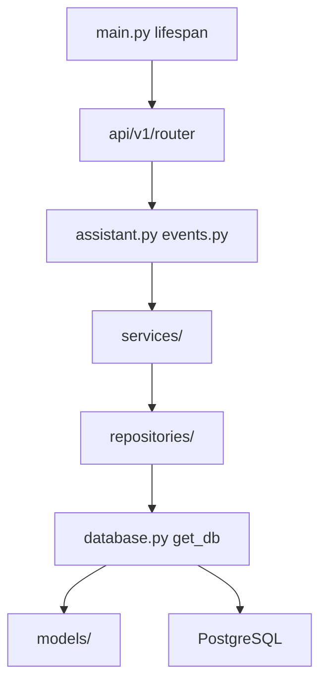

# Структура backend-сервиса diaai

Сводка и design review структуры FastAPI backend. Опирается на [ADR-002](../adr/adr-002-backend-stack.md) · [task-03 scaffold](../tasks/impl/backend/iteration-2-core/tasks/task-03-scaffold/plan.md) · skill [fastapi-templates](../../.agents/skills/fastapi-templates/SKILL.md).

## Статус реализации

Каталог `backend/` **реализован** (task-03–05 ✅). Слои `services/`, `repositories/`, `models/`, `database.py` — task-05.

## Целевое дерево (MVP)

### Task-03 — каркас

```
backend/
├── __init__.py
├── main.py                 # create_app(), lifespan, middleware
├── config.py               # pydantic-settings
├── exceptions.py           # AppError → ErrorBody
├── api/
│   ├── deps.py             # verify_service_token, get_settings
│   └── v1/
│       ├── router.py         # include assistant + events
│       ├── assistant.py      # async routes
│       └── events.py
├── schemas/
│   ├── assistant.py
│   ├── events.py
│   └── errors.py
└── tests/
    ├── conftest.py           # AsyncClient, auth/payload fixtures
    ├── test_health.py
    ├── test_auth.py          # task-04
    ├── test_validation.py    # task-04
    ├── test_assistant.py     # task-04
    └── test_events.py        # task-04
```

### Task-05 — дополнение

```
backend/
├── database.py             # engine, AsyncSessionLocal, get_db
├── models/                 # SQLAlchemy ORM (один файл — одна модель)
├── repositories/
└── services/
alembic/                    # корень репо (рядом с backend/)
alembic.ini
```

## Маппинг fastapi-templates → diaai

| fastapi-templates | diaai (ADR-002, KISS) | Фаза |
|-------------------|------------------------|------|
| `app/main.py` | `backend/main.py` | 03 |
| `app/core/config.py` | `backend/config.py` (без `core/`) | 03 |
| `app/core/database.py` | `backend/database.py` | 05 |
| `app/api/dependencies.py` | `backend/api/deps.py` | 03 |
| `app/api/v1/endpoints/*.py` | `backend/api/v1/{assistant,events}.py` | 03 |
| `app/api/v1/router.py` | `backend/api/v1/router.py` | 03 |
| `app/schemas/` | `backend/schemas/` | 03 |
| `app/services/` | `backend/services/` | 05 |
| `app/repositories/` | `backend/repositories/` | 05 |
| `app/models/` | `backend/models/` | 05 |
| `tests/conftest.py` + `dependency_overrides` | `backend/tests/conftest.py` | 03–04 |

**Обоснование отличий:** один пакет `backend/` в корне репо (не `src/`), без лишнего `core/` — [conventions.mdc](../../.cursor/rules/conventions.mdc), KISS.

## Design review (fastapi-templates)

Проверка по [SKILL.md](../../.agents/skills/fastapi-templates/SKILL.md) и [details.md](../../.agents/skills/fastapi-templates/references/details.md).

### Pass

| Критерий | diaai |
|----------|-------|
| Async route handlers | `async def` в v1 routers (task-03) |
| Dependency injection | `api/deps.py`: Bearer, settings; task-05: `get_db` |
| Lifespan | `@asynccontextmanager` в `main.py`; DB в task-05 |
| Router aggregation | `api/v1/router.py` → `include_router(..., prefix="/api/v1")` |
| Pydantic schemas отдельно от routes | `backend/schemas/` |
| Service / repository слои | task-05; тонкие repos без base generic на MVP |
| Testing | httpx `AsyncClient`, `ASGITransport`, fixtures (task-03/04); 17 contract tests |
| App factory | `create_app()` для tests (task-03) |

### Warn (зафиксировано, не блокирует MVP)

| Критерий | Наблюдение | Решение |
|----------|------------|---------|
| CORS middleware | в шаблоне есть | defer до web-клиента (iteration 5) |
| `core/` subpackage | шаблон использует | плоский `config.py`, `database.py` — ADR-002 |
| BaseRepository generic | шаблон | не вводить на MVP; простые repos в task-05 |
| `endpoints/` subfolder | шаблон | два домена — файлы в `v1/` достаточно |
| Monorepo pyproject | сейчас только `src/diaai` | task-03: добавить discovery для `backend/` |

### Fix (внести при task-03)

| Проблема | Действие |
|----------|----------|
| `pyproject.toml` без backend | `[tool.setuptools.packages.find] where = ["src", "."]` или явный `packages` для `backend` |
| Нет `__init__.py` в плане | добавить в task-03 чеклист |
| Alembic путь | `alembic/` в корне репо; `script_location` → `backend.models` metadata |
| Health вне v1 | `GET /health` на app root, не под `/api/v1` — по openapi |

## Поток зависимостей (task-05)



## pyproject.toml (целевой фрагмент)

```toml
dependencies = [
  # bot ...
  "fastapi>=0.115.0",
  "uvicorn[standard]>=0.32.0",
  "pydantic-settings>=2.0.0",
]

[dependency-groups]
dev = [
  "ruff>=0.14.0",
  "httpx>=0.28.0",
  "pytest>=8.0.0",
  "pytest-asyncio>=0.24.0",
]

[tool.setuptools.packages.find]
where = ["src", "."]
include = ["diaai*", "backend*"]
```

Task-05 добавит: `sqlalchemy[asyncio]`, `asyncpg`, `alembic`.

## Связанные документы

| Документ | Содержание |
|----------|------------|
| [api-contracts.md](api-contracts.md) | REST v1, endpoints |
| [task-03 plan](../tasks/impl/backend/iteration-2-core/tasks/task-03-scaffold/plan.md) | каркас |
| [task-04 plan](../tasks/impl/backend/iteration-2-core/tasks/task-04-api-tests/plan.md) | contract tests |
| [task-05 plan](../tasks/impl/backend/iteration-2-core/tasks/task-05-api-impl/plan.md) | impl + БД |
| [ADR-002](../adr/adr-002-backend-stack.md) | стек |
