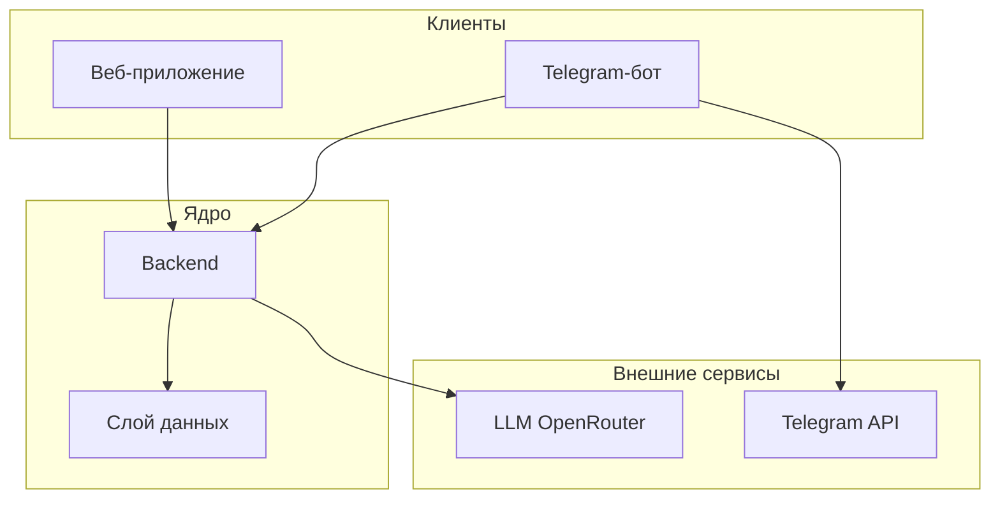
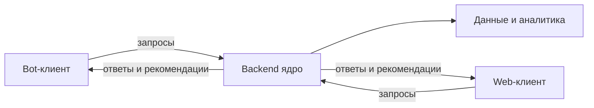
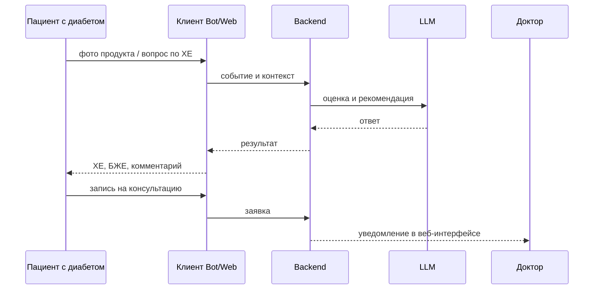
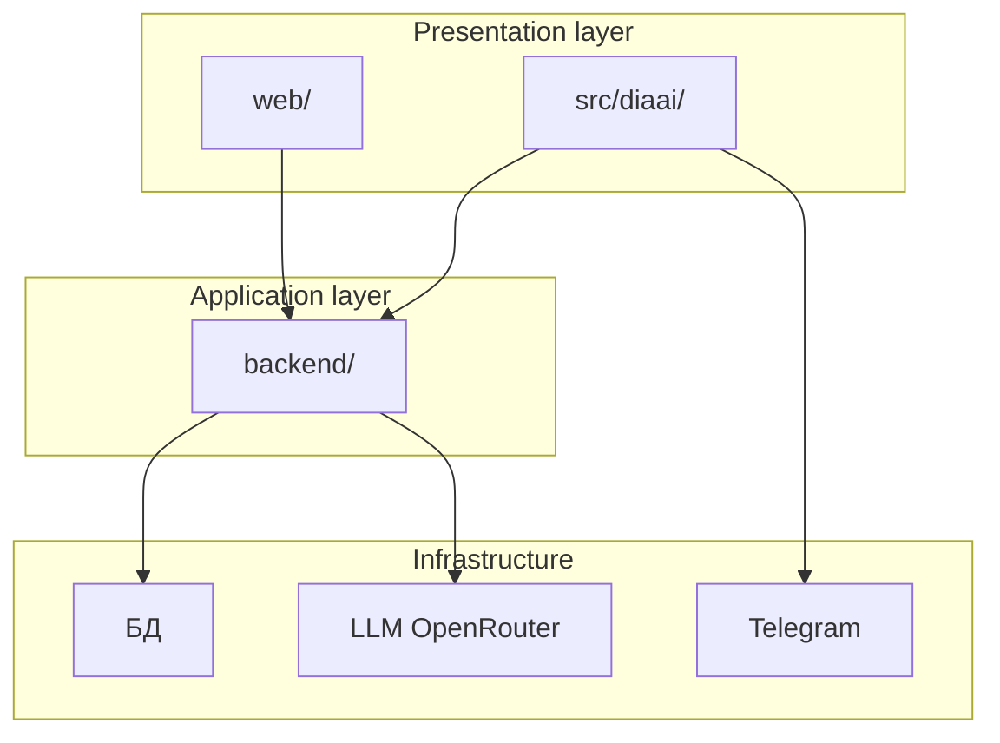
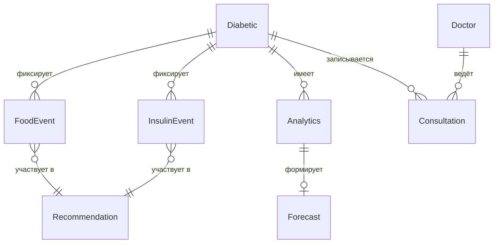
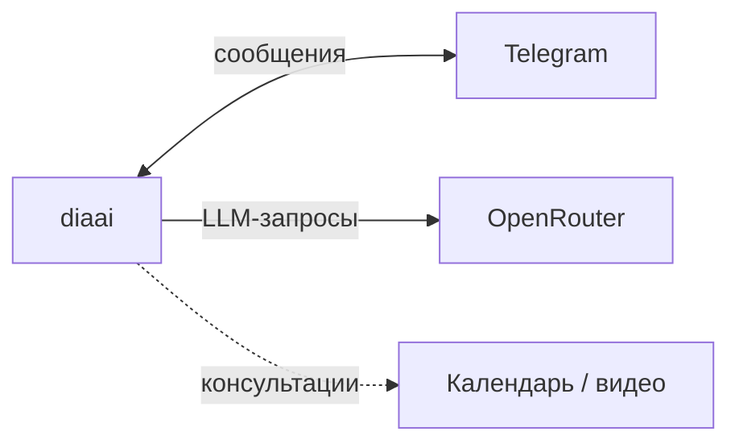

# Техническое видение проекта

Опирается на [идею проекта](idea.md).  
Детализация: [architecture.md](architecture.md) · [data-model.md](data-model.md) · [integrations.md](integrations.md) · [adr/](adr/)

---

## Границы системы

**diaai** — система сопровождения пациентов с диабетом, а не отдельный Telegram-бот.

| Компонент | Роль |
|-----------|------|
| **Telegram-бот** | первый клиент: диалог, быстрая фиксация, расчёт ХЕ/БЖЕ по тексту и фото |
| **Веб-приложение** | единый frontend-проект с ролями: интерфейс пациента с диабетом (аналитика), интерфейс доктора (опционально) |
| **Backend** | ядро системы: бизнес-логика, данные, сопровождение потоков |
| **Слой данных** | персистентное хранение профилей, событий, аналитики, записей |
| **LLM** | внешний сервис для оценки питания, рекомендаций и диалога |



---

## Архитектурный принцип

**Бот — не ядро.** Ядро — единый серверный слой (backend). Бот и веб — клиенты этого ядра, а не самостоятельные продукты.

- Telegram-бот и веб — **тонкие клиенты**: отображение, ввод, маршрутизация действий пользователя.
- Backend централизует: сопровождение потоков, работу с материалами (фото, записи), прогресс, результаты, аналитику, рекомендации.
- Клиенты не дублируют бизнес-логику; данные и контекст едины для всех интерфейсов.



---

## Роли и сценарии

### Роли

| Роль | Доступ |
|------|--------|
| **Пациент с диабетом** | диалог, фиксация питания и инсулина, аналитика своего состояния, запись к доктору |
| **Доктор** (опционально) | обзор данных пациентов, консультации, комментарии — через веб-интерфейс |

### Сценарии пациента с диабетом

| Сценарий | Описание |
|----------|----------|
| **Проверка ХЕ** | оценка по описанию, фото блюда или **фото продукта** (упаковка, этикетка) |
| **Проверка БЖЕ** | расчёт белково-жировых единиц для блюда или продукта |
| **Инсулин** | справочная информация: сколько может потребоваться и **в течение какого времени** — в контексте еды и истории; без назначения доз |
| **Динамика состояния** | тренды потребления ХЕ, БЖЕ, инсулина; сигналы улучшений и ухудшений |
| **Запись на консультацию** | онлайн или офлайн приём у доктора через систему |
| **Рекомендации** | выдача на основе потребления инсулина и пищи в динамике, с элементами прогнозирования |

### Сценарии доктора (опционально)

- просмотр аналитики и динамики пациента;
- проведение и подтверждение консультаций;
- комментарии и рекомендации в рамках медицинского сопровождения.



> Справочная поддержка, не замена врача. Система не назначает дозы инсулина.

---

## Архитектура системы (high-level)

### Основные части

| Часть | Назначение |
|-------|------------|
| **Telegram-бот** | клиент для мобильного диалога: текст, фото, быстрые фиксации |
| **Веб-приложение** | клиент для аналитики, обзора состояния, роли доктора |
| **Backend** | API-слой, доменная логика, оркестрация LLM, аналитика, записи |
| **Слой данных** | БД: пользователи, события питания/инсулина, аналитика, консультации |
| **LLM-компонент** | внешний провайдер (OpenRouter): vision, диалог, рекомендации |



### Эволюция от MVP

| Этап | Состояние |
|------|-----------|
| **MVP (было)** | Telegram-бот автономно; история в RAM; прямой LLM |
| **Сейчас** | bot + backend + web → PostgreSQL; web iter 0–9 ✅; voice ✅; Text-to-SQL ✅; backend analytics REST 📋 |
| **Следующее** | `/api/v1/analytics/*`, consultations UI (D5/D6, Doc2–Doc4), production deploy |

MVP — первый шаг: проверка сценариев и ценности. Дальше — analytics REST и консультации без смены продуктовой модели.

---

## Доменные сущности

Ключевые понятия системы (детали — в [data-model.md](data-model.md); сценарии и read/write — [docs/spec/](spec/)):

| Сущность | Смысл |
|----------|--------|
| **Пациент с диабетом** | пользователь системы, ведёт дневник питания и инсулина |
| **Доктор** | специалист с доступом к данным пациентов (опционально) |
| **Событие питания** | приём пищи, продукт, оценка ХЕ и БЖЕ |
| **Событие инсулина** | фиксация дозы, время, связь с едой |
| **Аналитика состояния** | агрегаты по ХЕ, БЖЕ, инсулину за период; тренды |
| **Рекомендация** | справочный вывод на основе динамики питания и инсулина |
| **Прогноз** | оценка вероятных сдвигов при сохранении текущих паттернов |
| **Консультация** | запись и проведение онлайн/офлайн приёма |



---

## Внешние связи

Обзор интеграций (детали — в [integrations.md](integrations.md)):

| Сервис | Назначение |
|--------|------------|
| **Telegram API** | доставка сообщений, приём текста и фото |
| **OpenRouter (LLM)** | диалог, vision (фото блюда/продукта), рекомендации |
| **Календарь / видеосвязь** (опционально) | онлайн-консультации |



---

## Структура репозитория

Multi-component проект:

```
diaai/
├── src/diaai/           # Telegram-клиент (bot)
├── backend/             # ядро: FastAPI, services, repos
├── web/                 # Next.js frontend (patient / doctor)
├── docs/
│   ├── idea.md
│   ├── vision.md
│   ├── data-model.md
│   ├── spec/            # сценарии и требования к данным
│   ├── adr/
│   ├── integrations.md
│   └── how-to-get-tokens.md
├── prompts/             # системные промпты LLM
└── README.md
```

**Текущее состояние:** bot в `src/diaai/` — клиент backend API ✅. `backend/` — FastAPI, PostgreSQL (9 таблиц), OpenRouter (LLM + STT), сценарии A/B + web API. `web/` — dashboard, leaderboard, chat, voice, Text-to-SQL ✅. Контракты: [api-contract.md](api/api-contract.md) · [frontend-contract.md](api/frontend-contract.md). Smoke: [smoke-test.md](smoke-test.md).

---

## Принципы разработки

- **KISS** — минимум слоёв, без преждевременной оптимизации.
- **Backend as core** — бизнес-логика в backend, клиенты тонкие.
- **Единый контекст** — данные пользователя общие для bot и web.
- **Явная конфигурация** — секреты через env, не в коде.
- **LLM как сервис** — промпты и роли задаются централизованно; vision для фото.
- **Поэтапность** — MVP бота → backend + БД → web + роли.

---

## Архитектурные решения

Значимые решения фиксируются в [docs/adr/](adr/) (Architecture Decision Records).

| ADR | Решение | Статус |
|-----|---------|--------|
| [adr-001-database.md](adr/adr-001-database.md) | **PostgreSQL** — основная СУБД | Принято |
| [adr-002-backend-stack.md](adr/adr-002-backend-stack.md) | **FastAPI** — стек backend | Принято |

**Кратко (ADR-001):** PostgreSQL выбран как единая реляционная БД для backend: пользователи, события, консультации, аналитика. JSONB — для ответов LLM и метаданных; фото — в object storage; при росте временных рядов — TimescaleDB или read-replica без смены СУБД.

Альтернативы (MySQL, MongoDB, SQLite для prod, отдельная TS-БД) отклонены — см. полное обоснование в ADR.

На этапе MVP-бота БД не используется (RAM); PostgreSQL подключается с первым backend.

---

## Технологии (backend)

| Компонент | Выбор |
|-----------|--------|
| Язык | Python 3.12+ |
| HTTP API | FastAPI, Uvicorn |
| СУБД | PostgreSQL ([ADR-001](adr/adr-001-database.md)) |
| ORM / миграции | SQLAlchemy 2, Alembic |
| Конфиг | pydantic-settings, env |
| LLM | openai-клиент → OpenRouter |
| Тесты | pytest, httpx |
| Линт / формат | ruff |
| Структура | `backend/` — см. [ADR-002](adr/adr-002-backend-stack.md) |

## Технологии (web)

| Компонент | Выбор |
|-----------|--------|
| Framework | Next.js (App Router) + React 19 |
| Язык | TypeScript |
| UI | shadcn/ui + Tailwind CSS |
| Package manager | pnpm 11.6 |
| Auth | BFF + httpOnly cookie (`diaai_session`) |
| Dev guide | [web/README.md](../web/README.md) |

---

## Технологии (MVP бота)

| Компонент | Выбор |
|-----------|--------|
| Язык | Python 3.12+ |
| Зависимости | `uv` |
| Telegram | aiogram 3.x, polling |
| LLM | через backend API *(prod)*; legacy direct OpenRouter только в dev-ветке MVP |
| Линт / формат | ruff |
| Автоматизация | Makefile: `install`, `run`, `lint`, `format` |

---

## LLM в системе

- **Провайдер:** OpenRouter.
- **Задачи:** оценка ХЕ/БЖЕ по тексту и фото, диалог, справочные рекомендации по инсулину в контексте еды.
- **Ограничения:** лимит истории, таймауты, понятные сообщения при ошибках; без назначения доз.
- **Целевое состояние:** вызовы LLM — через backend ✅ *(bot, web assistant, STT, Text-to-SQL)*.

---

## Конфигурация (бот)

| Переменная | Назначение |
|------------|------------|
| `TELEGRAM_BOT_TOKEN` | токен бота |
| `BACKEND_URL` | URL backend (default `http://127.0.0.1:8000`) |
| `BACKEND_SERVICE_TOKEN` | Bearer bot → backend |
| `LOG_LEVEL` | уровень логирования |

OpenRouter и LLM — на стороне backend (см. [backend/README.md](../backend/README.md)).

`.env` в `.gitignore`. Секреты не коммитить.

---

## Логирование

- Стандартный `logging`, уровень из env.
- Логировать: старт/остановка, идентификаторы сессий, ошибки API.
- Не логировать: тексты сообщений, промпты, токены, ключи.

---

## Сборка и запуск

```bash
make db-reset && make backend-run   # PostgreSQL + API :8000
make run                            # бот (отдельный терминал)
make web-dev                        # web :3000 — см. web/README.md
make test                           # 84 tests
```

Локальный чеклист: [smoke-test.md](smoke-test.md). Production deploy (bot + backend + web) — post-MVP, см. [plan.md](plan.md#post-mvp-не-в-таблице-этапов).
