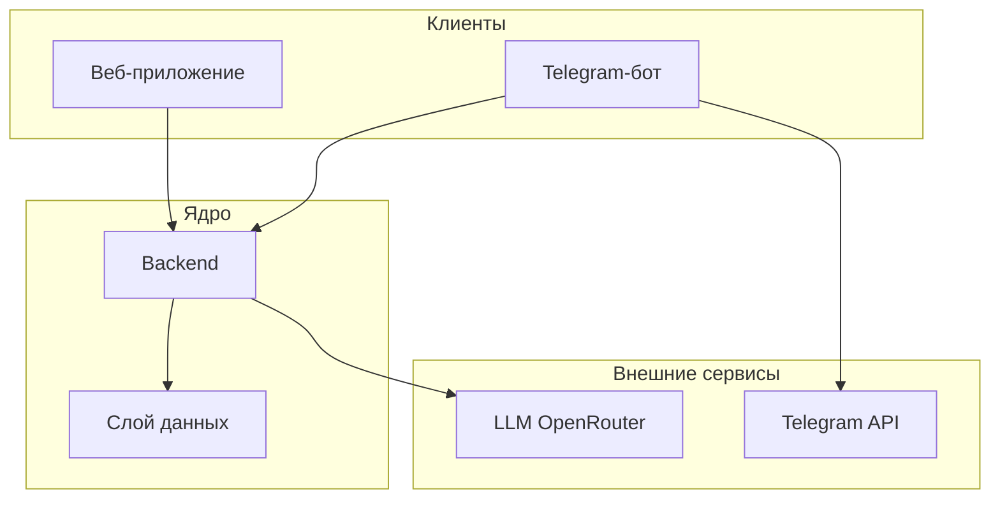
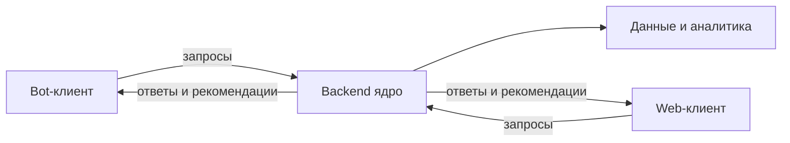
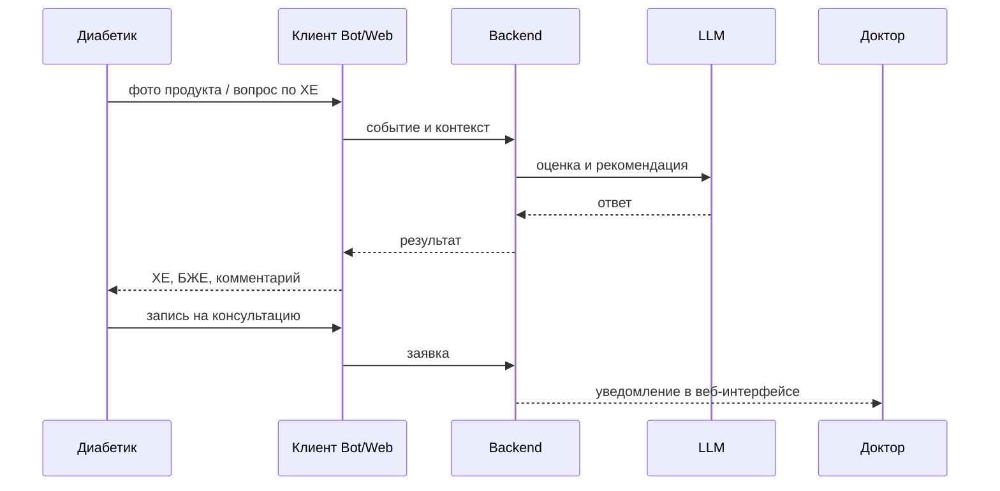
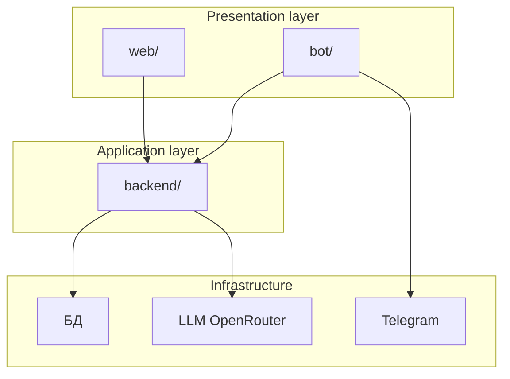
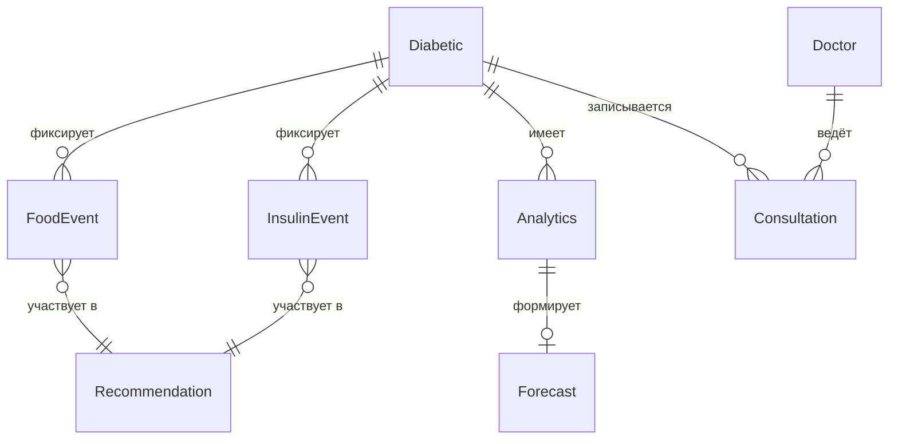
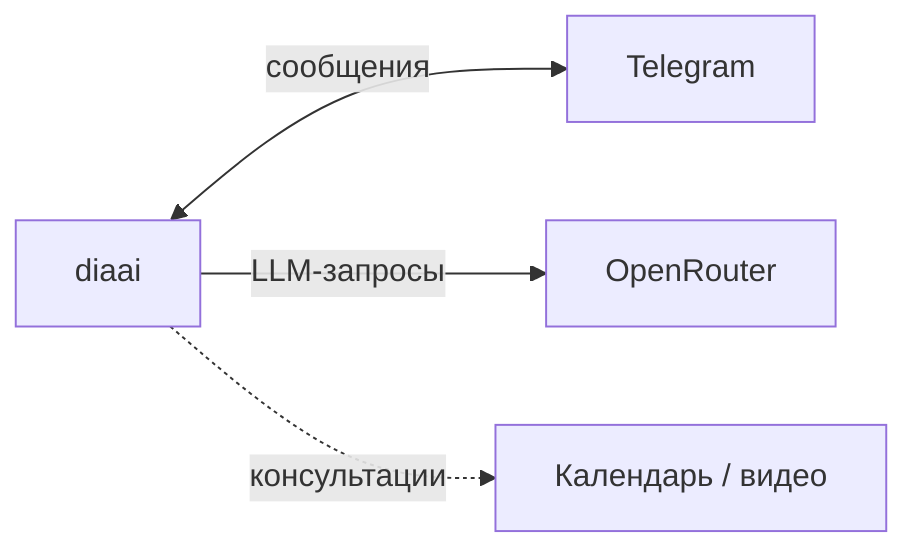

# Техническое видение проекта

Опирается на [идею проекта](idea.md).  
Детализация: [data-model.md](data-model.md) · [integrations.md](integrations.md)

---

## Границы системы

**diaai** — система сопровождения диабетиков, а не отдельный Telegram-бот.

| Компонент | Роль |
|-----------|------|
| **Telegram-бот** | первый клиент: диалог, быстрая фиксация, расчёт ХЕ/БЖЕ по тексту и фото |
| **Веб-приложение** | единый frontend-проект с ролями: интерфейс диабетика (аналитика), интерфейс доктора (опционально) |
| **Backend** | ядро системы: бизнес-логика, данные, сопровождение потоков |
| **Слой данных** | персистентное хранение профилей, событий, аналитики, записей |
| **LLM** | внешний сервис для оценки питания, рекомендаций и диалога |



---

## Архитектурный принцип

**Бот — не ядро.** Ядро — единый серверный слой (backend).

- Telegram-бот и веб — **тонкие клиенты**: отображение, ввод, маршрутизация действий пользователя.
- Backend централизует: сопровождение потоков, работу с материалами (фото, записи), прогресс, результаты, аналитику, рекомендации.
- Клиенты не дублируют бизнес-логику; данные и контекст едины для всех интерфейсов.



---

## Роли и сценарии

### Роли

| Роль | Доступ |
|------|--------|
| **Диабетик** | диалог, фиксация питания и инсулина, аналитика своего состояния, запись к доктору |
| **Доктор** (опционально) | обзор данных пациентов, консультации, комментарии — через веб-интерфейс |

### Сценарии диабетика

| Сценарий | Описание |
|----------|----------|
| **Проверка ХЕ** | оценка по описанию, фото блюда или **фото продукта** (упаковка, этикетка) |
| **Проверка БЖЕ** | расчёт белково-жировых единиц для блюда или продукта |
| **Инсулин** | справочная информация: сколько может потребоваться и **в течение какого времени** — в контексте еды и истории; без назначения доз |
| **Динамика состояния** | тренды потребления ХЕ, БЖЕ, инсулина; сигналы улучшений и ухудшений |
| **Запись на консультацию** | онлайн или офлайн приём у доктора через систему |
| **Рекомендации** | выдача на основе потребления инсулина и пищи в динамике, с элементами прогнозирования |

### Сценарии доктора (опционально)

- просмотр аналитики и динамики пациента;
- проведение и подтверждение консультаций;
- комментарии и рекомендации в рамках медицинского сопровождения.



> Справочная поддержка, не замена врача. Система не назначает дозы инсулина.

---

## Архитектура системы (high-level)

### Основные части

| Часть | Назначение |
|-------|------------|
| **Telegram-бот** | клиент для мобильного диалога: текст, фото, быстрые фиксации |
| **Веб-приложение** | клиент для аналитики, обзора состояния, роли доктора |
| **Backend** | API-слой, доменная логика, оркестрация LLM, аналитика, записи |
| **Слой данных** | БД: пользователи, события питания/инсулина, аналитика, консультации |
| **LLM-компонент** | внешний провайдер (OpenRouter): vision, диалог, рекомендации |



### Эволюция от MVP

| Этап | Состояние |
|------|-----------|
| **MVP (сейчас)** | Telegram-бот как автономный клиент; история в RAM; прямой вызов LLM |
| **Целевая архитектура** | bot и web → backend → БД; единый контекст пользователя, аналитика, консультации |

MVP — первый шаг: проверка сценариев и ценности. Дальше — перенос логики в backend без смены продуктовой модели.

---

## Доменные сущности

Ключевые понятия системы (детали — в [data-model.md](data-model.md)):

| Сущность | Смысл |
|----------|--------|
| **Диабетик** | пользователь системы, ведёт дневник питания и инсулина |
| **Доктор** | специалист с доступом к данным пациентов (опционально) |
| **Событие питания** | приём пищи, продукт, оценка ХЕ и БЖЕ |
| **Событие инсулина** | фиксация дозы, время, связь с едой |
| **Аналитика состояния** | агрегаты по ХЕ, БЖЕ, инсулину за период; тренды |
| **Рекомендация** | справочный вывод на основе динамики питания и инсулина |
| **Прогноз** | оценка вероятных сдвигов при сохранении текущих паттернов |
| **Консультация** | запись и проведение онлайн/офлайн приёма |



---

## Внешние связи

Обзор интеграций (детали — в [integrations.md](integrations.md)):

| Сервис | Назначение |
|--------|------------|
| **Telegram API** | доставка сообщений, приём текста и фото |
| **OpenRouter (LLM)** | диалог, vision (фото блюда/продукта), рекомендации |
| **Календарь / видеосвязь** (опционально) | онлайн-консультации |



---

## Структура репозитория

Multi-component проект:

```
diaai/
├── bot/                 # Telegram-клиент (MVP реализован в src/diaai/)
├── backend/             # ядро системы (целевой компонент)
├── web/                 # единый frontend, роли диабетик / доктор
├── docs/
│   ├── idea.md
│   ├── vision.md
│   ├── data-model.md    # доменные сущности и связи
│   ├── integrations.md  # внешние сервисы
│   └── how-to-get-tokens.md
├── prompts/             # системные промпты LLM
└── README.md
```

**Текущее состояние:** код бота в `src/diaai/` — MVP первого клиента. При переходе к целевой архитектуре логика мигрирует в `backend/`, `bot/` становится тонким клиентом.

---

## Принципы разработки

- **KISS** — минимум слоёв, без преждевременной оптимизации.
- **Backend as core** — бизнес-логика в backend, клиенты тонкие.
- **Единый контекст** — данные пользователя общие для bot и web.
- **Явная конфигурация** — секреты через env, не в коде.
- **LLM как сервис** — промпты и роли задаются централизованно; vision для фото.
- **Поэтапность** — MVP бота → backend + БД → web + роли.

---

## Технологии (текущий MVP бота)

| Компонент | Выбор |
|-----------|--------|
| Язык | Python 3.12+ |
| Зависимости | `uv` |
| Telegram | aiogram 3.x, polling |
| LLM | OpenAI-compatible клиент, **OpenRouter** |
| Линт / формат | ruff |
| Автоматизация | Makefile: `install`, `run`, `lint`, `format` |

Стек backend и web — определяется на этапе их реализации; не фиксируется в MVP.

---

## LLM в системе

- **Провайдер:** OpenRouter.
- **Задачи:** оценка ХЕ/БЖЕ по тексту и фото, диалог, справочные рекомендации по инсулину в контексте еды.
- **Ограничения:** лимит истории, таймауты, понятные сообщения при ошибках; без назначения доз.
- **Целевое состояние:** вызовы LLM — через backend, не напрямую из клиентов.

---

## Конфигурация (MVP бота)

| Переменная | Назначение |
|------------|------------|
| `TELEGRAM_BOT_TOKEN` | токен бота |
| `OPENROUTER_API_KEY` / `LLM_API_KEY` | ключ OpenRouter |
| `LLM_MODEL` | модель (vision для фото) |
| `LLM_MAX_HISTORY` | пар сообщений в контексте |
| `LOG_LEVEL` | уровень логирования |

`.env` в `.gitignore`. Секреты не коммитить.

---

## Логирование

- Стандартный `logging`, уровень из env.
- Логировать: старт/остановка, идентификаторы сессий, ошибки API.
- Не логировать: тексты сообщений, промпты, токены, ключи.

---

## Сборка и запуск (MVP)

```bash
make install   # uv venv + uv sync
make run       # запуск бота
make lint      # ruff check
make format    # ruff format
```

Деплой multi-component системы — на этапе появления backend и web.
